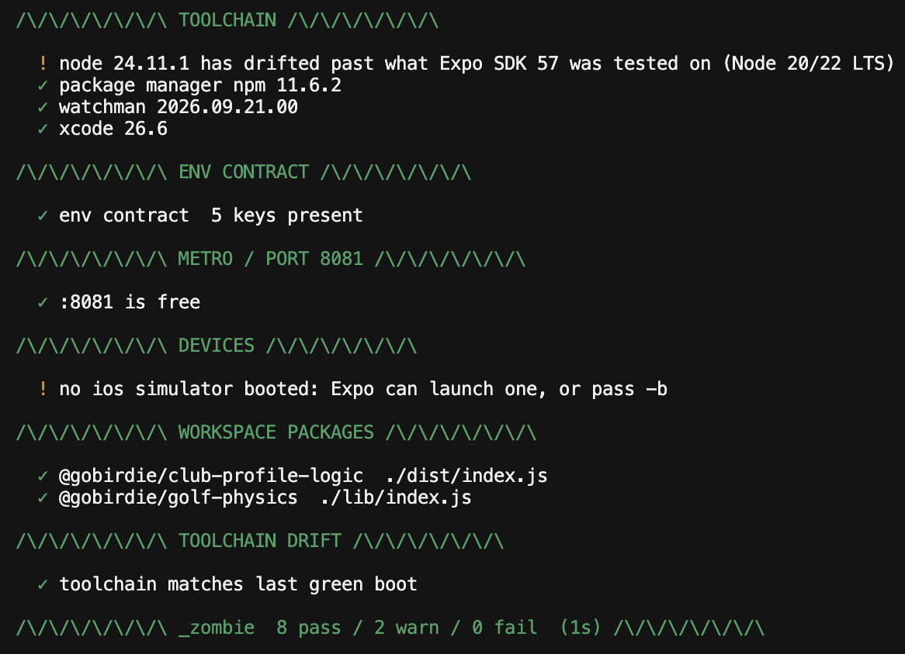

# Monday Bash Bang

<p align="center">
  <a href="https://github.com/OttoM1/Monday-bash-bang">
    
  </a>
</p>

[](LICENSE)
[](https://www.gnu.org/software/bash/)
[](https://expo.dev)
[](./_until-green.sh)

bash scripts i actually use (review them for your own setup before using them in production/commercial projects).
individual files, copy whatever you like.
note: the `_hulk-smash.sh` needs `_zombie.sh` and `_until-green.sh` alongside for it to work.
`_zombie.sh` doesn't install dependencies; `_until-green.sh` does, so don't run the auto-fix blind in production.

## Navigate to:

- [Until Green Script](#until-green-script)
  - [Quick breakdown](#quick-breakdown)
  - [Put `_until-green.sh` in your project?](#put-_until-greensh-in-your-project)
- [Zombie Script](#zombie-script)
  - [Quick breakdown](#quick-breakdown-1)
  - [Put `_zombie.sh` in your project?](#put-_zombiesh-in-your-project)
- [Hulk Smash Script](#hulk-smash-script)
  - [Quick breakdown](#quick-breakdown-2)
  - [Put `_hulk-smash.sh` in your project?](#put-_hulk-smashsh-in-your-project)
- [App Script](#app-script)
  - [Install `_app.sh`?](#install-_appsh)
- [License](#license)

## Until Green Script

[`./_until-green.sh`](./_until-green.sh)

one command to get an automated pipeline to check current repo/branch/tree, fix vulnerabilities and get the simulator running in a react native / expo project.

### Quick breakdown:

runs `git remote -v`, `expo-doctor`, loops `expo install --fix` until every package matches your SDK, then `npx expo start` starts the app.
review the changes it makes before using it in a commercial project.

### Put `_until-green.sh` in your project?

```bash
curl -o bash/_until-green.sh https://raw.githubusercontent.com/OttoM1/Monday-bash-bang/main/_until-green.sh
chmod +x ./bash/_until-green.sh # ./bash is just an example folder name, set it to whatever you want
bash _until-green.sh
```

then add `"go": "bash bash/_until-green.sh"` to your `package.json` scripts and run `npm run go`.

it should find the project root by walking up to the nearest `package.json`, so it doesn't care which folder you run it from.
(also reads your lockfile to pick npm/yarn/pnpm/bun)

## Zombie Script

[`./_zombie.sh`](./_zombie.sh)

pre-flight for an Expo repo: toolchain, env, metro port, devices, monorepo packages, optional tsc/lint/tests and a snapshot so you can see drift. stops before `expo start`. use it when you want diagnostics without touching deps.

### Quick breakdown:

walks up to the nearest `package.json`, then runs sections in order:

- node vs SDK, lockfile package manager, watchman, Xcode/Android SDK.
- &
- `.env.example` vs `.env`.
- &
- metro port.
- &
- simulator/emulator.
- &
- artifacts + optional build
- &
- optional quality gate and toolchain drift.
- &
- flags exits so no downstream on metro.

### Put `_zombie.sh` in your project?

```bash
curl -o bash/_zombie.sh https://raw.githubusercontent.com/OttoM1/Monday-bash-bang/main/_zombie.sh
chmod +x ./bash/_zombie.sh # ./bash is just an example folder name, set it to whatever you want
bash _zombie.sh
```

- then: `"zombie": "bash bash/_zombie.sh -p ios -k -b"` in `package.json`
- or: `./bash/_zombie.sh -g` metro CI

## Hulk Smash Script

[`./_hulk-smash.sh`](./_hulk-smash.sh)

full stack in one shot: `_zombie.sh` first and `_until-green.sh` (doctor, fix deps, `expo start`). needs `_zombie.sh` and `_until-green.sh` in the same space.

### Quick breakdown:

pretty straightforward, runs the previous scripts together.

### Put `_hulk-smash.sh` in your project?

```bash
curl -o bash/_zombie.sh https://raw.githubusercontent.com/OttoM1/Monday-bash-bang/main/_zombie.sh
curl -o bash/_until-green.sh https://raw.githubusercontent.com/OttoM1/Monday-bash-bang/main/_until-green.sh
curl -o bash/_hulk-smash.sh https://raw.githubusercontent.com/OttoM1/Monday-bash-bang/main/_hulk-smash.sh
chmod +x ./bash/_zombie.sh ./bash/_until-green.sh ./bash/_hulk-smash.sh
```

then `"smash": "bash bash/_hulk-smash.sh -p ios -k -b"` or whatever path you used and `npm run smash`.

## App Script

[`./_app.sh`](./_app.sh)

added an old beginner bootstrap script here as well. has nothing to do with the previous scripts.
what it does is; automates the checks for bash, git, node 20+ and npm, then runs `create-expo-app` under `~/Desktop/new-expo-app` and installs a small default set of Expo packages + prettier/eslint.
run it from CLI.

### Install `_app.sh`?

```bash
curl -o _app.sh https://raw.githubusercontent.com/OttoM1/Monday-bash-bang/main/_app.sh
chmod +x ./_app.sh
bash _app.sh
```

run `./_app.sh` (interactive app name) or `./_app.sh my-app` to pick the folder name. when it finishes, `cd` into the new app on your Desktop and `npx expo start`, or chain into `_hulk-smash.sh` once the project exists.

## License

[MIT](LICENSE)

--- OttoM1 ---
